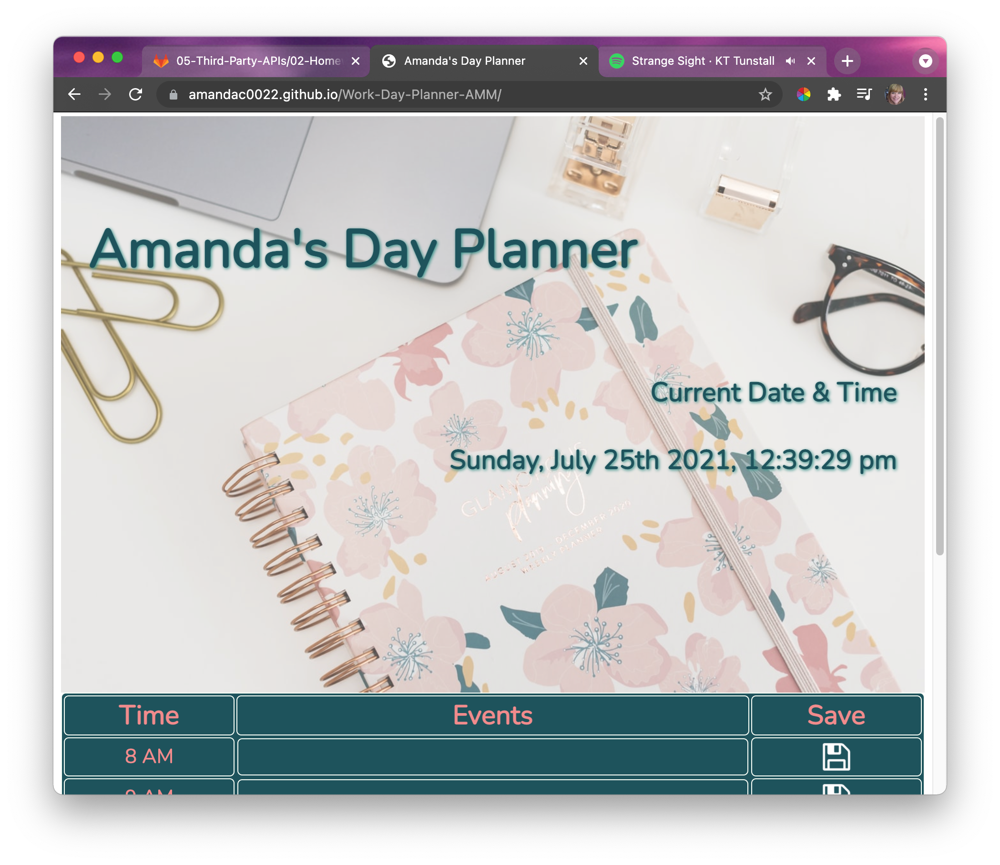
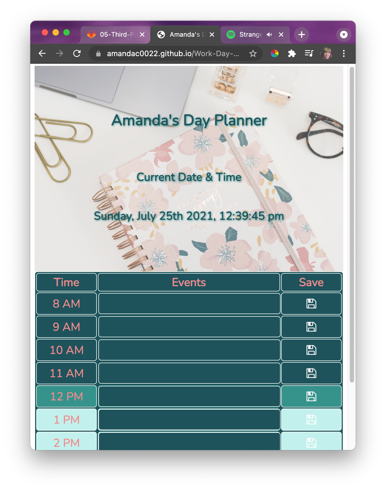

# Work-Day-Planner-AMM

## Description 
With this webpage, you can keep up with all of your events during the workday. The table is interactive. When you hover over a cell, it lights up yellow. When you click on any event cell, you can add test. Once you click the save image, it will save the input. Even if you refresh the page, your input will still be displayed! An added feature, is the current time row is shown in medium blue. Dark blue shows that time has already passed, and lightblue shows that it is in the future. If you would like to delete any inputs, just click the save button again and refresh the page. The input will be blank. If you would like to change any inputs, click on the input (background will be yellow), type in your new input, and click save. Ta Da! 

## List of Technologies: 
- HTML
- CSS 
- JavaScript
- JQuery 
- Moment.JS
- Git 
- GitHub
- Markdown 

## Link to Deployed Application 
https://amandac0022.github.io/Work-Day-Planner-AMM/

## Github Repo Link 
https://github.com/AmandaC0022/Work-Day-Planner-AMM

## Screenshots of Deployed Webpage 

### For Larger Screens 

### For Mobile Devices 

## Creator 
Amanda Morgan GitHub Profile: https://github.com/AmandaC0022

## License 
Copyright 2021

Permission is hereby granted, free of charge, to any person obtaining a copy of this software and associated documentation files (the "Software"), to deal in the Software without restriction, including without limitation the rights to use, copy, modify, merge, publish, distribute, sublicense, and/or sell copies of the Software, and to permit persons to whom the Software is furnished to do so, subject to the following conditions:

The above copyright notice and this permission notice shall be included in all copies or substantial portions of the Software.

THE SOFTWARE IS PROVIDED "AS IS", WITHOUT WARRANTY OF ANY KIND, EXPRESS OR IMPLIED, INCLUDING BUT NOT LIMITED TO THE WARRANTIES OF MERCHANTABILITY, FITNESS FOR A PARTICULAR PURPOSE AND NONINFRINGEMENT. IN NO EVENT SHALL THE AUTHORS OR COPYRIGHT HOLDERS BE LIABLE FOR ANY CLAIM, DAMAGES OR OTHER LIABILITY, WHETHER IN AN ACTION OF CONTRACT, TORT OR OTHERWISE, ARISING FROM, OUT OF OR IN CONNECTION WITH THE SOFTWARE OR THE USE OR OTHER DEALINGS IN THE SOFTWARE.